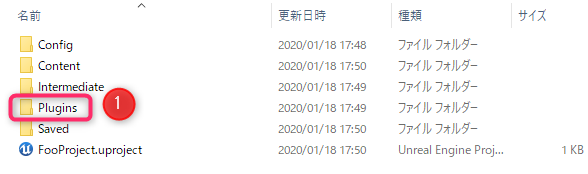

# HTN Graph Plugin(EN)

Editor for building HTN domains on Unreal Engine 4 (UE4).

## Required plugin

- **HTN Planner**

## Supported features

- Editor for creating HTN Domain

## Unsupported features

- Debug
  - Blakepoint
  - Highlighting running nodes

## How to use

- Select ** HTNGraphEditor-> HTN Graph Editor ** from Add New button of Content Browser

- Open HTN Graph Asset and build Domain

- Add ** HTN Component ** (this is an Actor Component) to the Blueprint that inherits from the Pawn or Character class

- Set the Enum asset representing the World State to ** World State Enum Asset ** in the details panel of HTN Component and set ** Default World State **

- To execute an action based on HTN planning, set an Enum asset representing the operation to be executed in ** Operator Enum Asset ** in the details panel of HTN Component, and set ** HTNO Operator Classes ** to ** HTNOperator_BlueprintBase ** Register a Blueprint that inherits the class.

- Pull the pin from the HTN Component in the ** Begin Play ** of the Blueprint to which the HTN Component is attached. Call the ** Build HTN Domain ** and ** Generate Plan **. At this time, HTN Graph used by AI is specified in Build HTN Domain.

- With the above, the action plan to be executed by AI can be obtained from HTN Graph Editor

---

- If the action to be executed is specified, the operator registered in HTN Operator Classes by calling ** Execute Operator ** from HTN Component using ** Tick event ** or ** Set Timer By Event ** Is executed based on the action plan.

## How to add a plugin to another project

- After creating another project, create a ** Plugins folder ** at the same level as the Content folder and Config folder

- Copy and paste the contents of the ** PackagePlugin folder ** into the created Plugins folder

---

# プロジェクトについて

Unreal Engine 4（UE4）でHTNドメインを構築するためのエディタを提供する。

## 必須プラグイン

- **HTN Planner**

## サポートしている機能

- HTN Domain作成のためのエディタ

## サポートしていない機能

- デバッグ機能
  - ブレークポイントの配置
  - 実行中のノードのハイライト

## 使い方

- Content BrowserのAdd Newボタンから **HTNGraphEditor -> HTN Graph Editor** を選択

- HTN Graph Editorを開きDomainを構築する

- PawnもしくはCharacterクラスを継承したブループリントに **HTN Component** （これはActor Component）を追加する

- HTN Component の詳細パネルにある **World State Enum Asset** にWorld Stateを表すEnumアセットをセットし**Default World State** を設定する

- HTNプランニングに基づいたアクションを実行させる場合にはHTN Componentの詳細パネルにある **Operator Enum Asset** に実行するオペレーションを表すEnumアセットをセットし **HTN Operator Classes** に**HTNOperator_BlueprintBase** クラスを継承したブループリントを登録する。

- HTN Componentがアタッチされたブループリントの **Begin Play** にてHTN Componentからピンを引っ張り **Build HTN Domain** と **Generate Plan** を呼ぶ。この時Build HTN DomainにはAIが使用するHTN Graphを指定する。

- 以上でHTN Graph EditorからAIが実行するべきアクションプランが得られる

---

- もし実行するアクションを指定している場合は **Tickイベント** もしくは **Set Timer By Event** を利用してHTN Component から **Execute Operator** を呼ぶことでHTN Operator Classesに登録したオペレータをアクションプランを基に実行する。

## 他プロジェクトへプラグインを追加するには

- 他プロジェクト作成後、ContentフォルダやConfigフォルダと同一階層に **Pluginsフォルダ** を作成する

- 作成したPluginsフォルダに **PackagePluginフォルダの中身を** コピー＆ペースト

- 念の為プロジェクトを開いて **HTNGraphプラグインとHTNPlannerプラグイン** が有効化されているかを確認する。