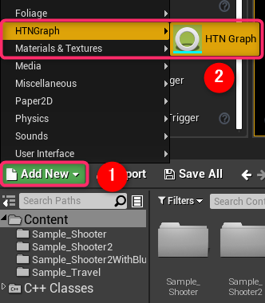
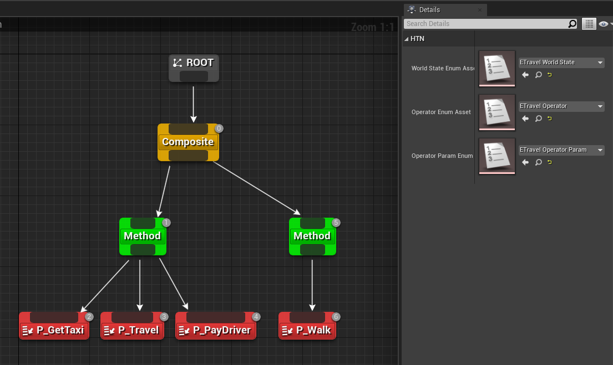
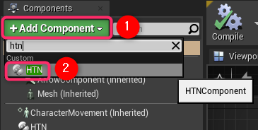
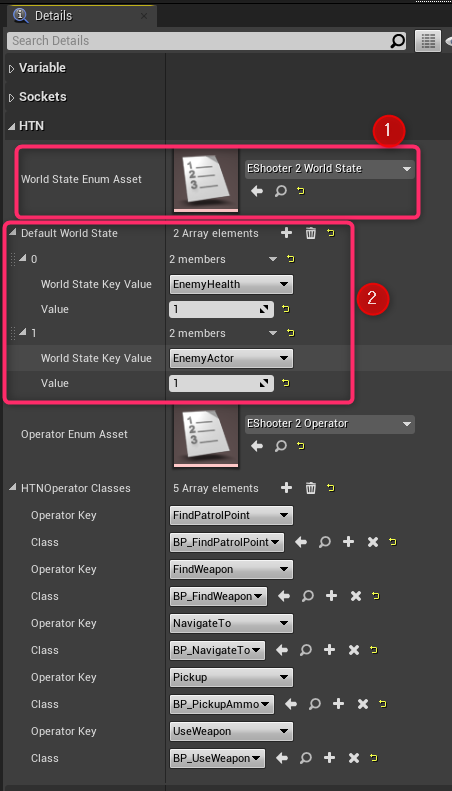
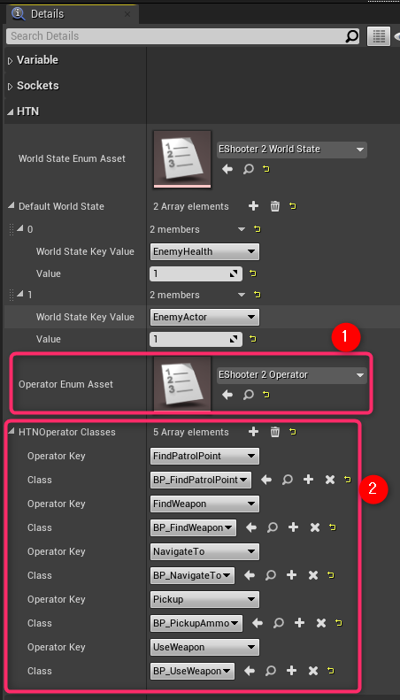
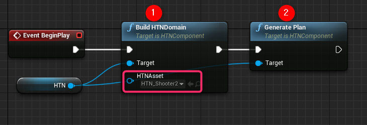
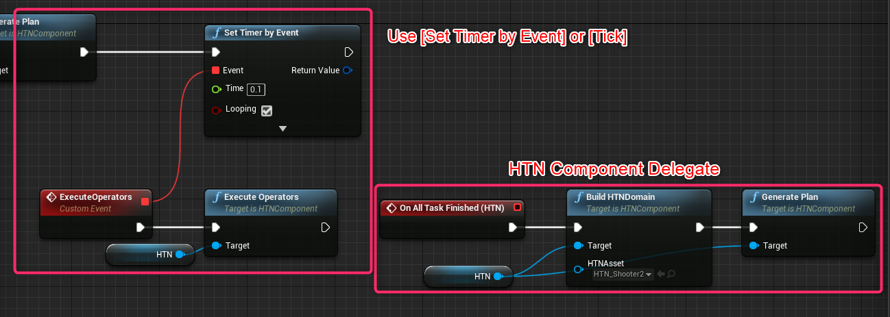

# プロジェクトについて

Unreal Engine 4（UE4）でHTNドメインを構築するためのエディタを提供する。

## 必須プラグイン

- **HTN Planner**

## 使い方

- Content BrowserのAdd Newボタンから **HTNGraphEditor -> HTN Graph Editor** を選択

- HTN Graph Editorを開きDomainを構築する

- PawnもしくはCharacterクラスを継承したブループリントに **HTN Component** （これはActor Component）を追加する

- HTN Component の詳細パネルにある **World State Enum Asset** にWorld Stateを表すEnumアセットをセットし**Default World State** を設定する

- HTNプランニングに基づいたアクションを実行させる場合にはHTN Componentの詳細パネルにある **Operator Enum Asset** に実行するオペレーションを表すEnumアセットをセットし **HTN Operator Classes** に**HTNOperator_BlueprintBase** クラスを継承したブループリントを登録する。

- HTN Componentがアタッチされたブループリントの **Begin Play** にてHTN Componentからピンを引っ張り **Build HTN Domain** と **Generate Plan** を呼ぶ。この時Build HTN DomainにはAIが使用するHTN Graphを指定する。

- 以上でHTN Graph EditorからAIが実行するべきアクションプランが得られる

---

- もし実行するアクションを指定している場合は **Tickイベント** もしくは **Set Timer By Event** を利用してHTN Component から **Execute Operator** を呼ぶことでHTN Operator Classesに登録したオペレータをアクションプランを基に実行する。

## 他プロジェクトへプラグインを追加するには

- Pluginsフォルダをそのまま他のプロジェクトフォルダにコピー＆ペースト
- プロジェクトフォルダに追加後プロジェクトを開き **HTN Graphプラグイン** と **HTN Plannerプラグイン**の両方を有効化する。

# メモ

ライセンスは「MITライセンス」で提供。

